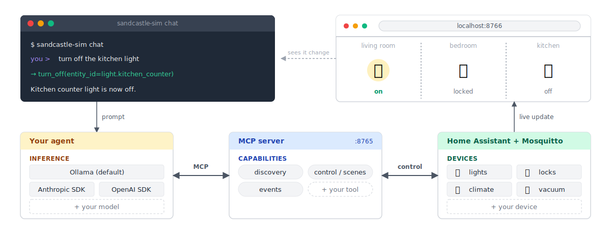
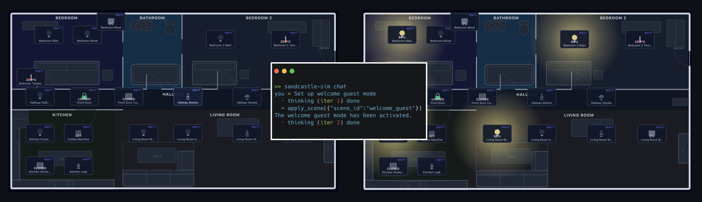

# sandcastle-sim


Sandcastle Sim is a sandbox for smart-home AI agents. Real Home Assistant (HA) and Mosquitto run in Docker; the devices are simulated and publish via standard MQTT discovery. From HA's perspective there's no difference between a simulated bulb and a real one, so an agent that works here works against a real home unchanged.

For developers building smart-home agents. One command brings up the full stack. A built-in CLI agent gets you to a working demo in minutes, then drop in your own when you're ready to iterate on prompts, UX, and edge cases.




## Contents

- [Install](#install)
- [Quickstart](#quickstart)
- [Eval suite](#eval-suite)
- [Next steps](#next-steps)
- [Read more](#read-more)

## Install

### Prerequisites

- [Docker](https://docs.docker.com/compose/) with Compose v2
- Python >= 3.10
- [Ollama](https://ollama.com) for the built-in CLI agent. Optional if you're connecting your own MCP agent.
- Tested on Mac (Apple Silicon), Linux, and Raspberry Pi 4/5. Windows not yet tested.

### Setup

Create and activate a virtual environment so the install stays isolated from your system Python:

```sh
python -m venv .venv
source .venv/bin/activate
```

Then install:

```sh
pip install sandcastle-sim
```

Planning to make code changes? Install editable from a checkout instead (`pip install -e .`). See [CONTRIBUTING.md](CONTRIBUTING.md) for the full dev setup.

in a **second terminal**, pull the model and start Ollama, this will take a few minutes depending on your connection:

```sh
ollama pull gemma4:e4b
```

```sh
ollama serve
```
Proceed with steps below while the model is downloading and Ollama is starting up.

## Quickstart

In your original terminal, run:

```sh
sandcastle-sim start
```

When the castle banner prints in the terminal, the stack is up. Open `http://localhost:8766` and you should see the floor plan. Click any device to turn it on or off, dim a light, or open a blind. That's the simulated home.

### Drive it with natural language
> **Note:** Only start chat below once Ollama is up and the model is ready from the earlier steps.

```sh
sandcastle-sim chat
```

A chat panel shows up listing the model and the available tools. For your first prompt, try:

```
set up welcome guest
```



You should see the floorplan update from the model's tool call like above.

Congratulations! You're now ready to explore and control your simulated smarthome with your agent 🏰

Run `sandcastle-sim --help` for the full command list.

Using an AI coding agent (Claude Code, Codex, Copilot)? Read [AGENTS.md](AGENTS.md) first.

## Eval suite

AI agents aren't deterministic. The same prompt can produce different outputs as you change the model, the system prompt, or the tool config. Small changes break things in non-obvious ways. The eval suite is how you catch that, and a quick way to see how performance looks on your hardware.

### Baseline (per host)

End-to-end latency on the bundled `quick.yaml` suite against the live stack (HA + MQTT + simulator + MCP) with `gemma4:e4b` (~4 B params, q4_K_M). 

**Avg/case** is the full round trip for one prompt — the model reads it, decides which tool to call, the MCP server dispatches the call, Home Assistant executes it and updates state, and the model writes its reply back. The eval pre-warms the model with a single token so per-case timings reflect steady-state cost only — the cold model-load you see once at the start of `sandcastle-sim chat` is excluded.

| Host | Pass | Avg/case | Slowest |
|---|---|---|---|
| **DGX Spark** (NVIDIA GB10, 128 GB unified) | 5/5 | 3.7 s | `state_query` 9.0 s |
| **MacBook Pro M3 Max** (36 GB unified) | 5/5 | 3.7 s | `state_query` 6.9 s |
| **MacBook Pro M3 Pro** (18 GB unified) | 5/5 | 6.3 s | `state_query` 15.7 s |

Numbers are **median of 3 repeats per case** (`--repeat 3`, the default) so single-shot noise on bandwidth-bound laptops doesn't show up as performance changes.

The five cases in `quick.yaml`:
- `light_off` — "turn off the kitchen counter light"
- `scene_named` — "set up movie night"
- `lock_door` — "lock the front door"
- `climate_setpoint` — "set the temperature to 22"
- `state_query` — "what lights are on right now?" (the heaviest case — the agent has to list devices, then answer)

### Try it

**1. Save a baseline snapshot** of how the agent behaves right now:

```sh
sandcastle-sim eval --save-baseline
```

**2. First go — see the diff workflow without writing any code.** Toggle off the agent's tool-routing optimisation for one run:

```sh
sandcastle-sim eval --no-routing --diff
```

Every case lands a bit slower (no failures), and the diff surfaces clean latency regressions against the baseline you just saved. The flag scopes to that one command; the next eval reverts to defaults automatically.

**3. Normal use — after you change your agent.** Make any change, then:

```sh
sandcastle-sim eval --diff
```

The report leads with cases that used to pass and now fail. Cases that got noticeably slower show up too. Exit code is non-zero if anything regressed, so a coding agent running this in a loop can tell when its own changes broke something.

[evals/quick.yaml](evals/quick.yaml) is the starter suite. Write your own to match your agent's acceptance bar.

## Next steps

### Extend the simulator

Add devices, tools, and scenes to make the sandbox match your target home. See [docs/extending-the-simulator.md](docs/extending-the-simulator.md).

### Connect cloud models

_Coming soon._

## Read more

- [AGENTS.md](AGENTS.md) : orientation for AI coding agents
- [docs/architecture.md](docs/architecture.md) : what runs where and why
- [docs/tool-contract.md](docs/tool-contract.md) : full MCP tool surface
- [docs/integrating-your-agent.md](docs/integrating-your-agent.md) : connect any MCP-speaking agent
- [docs/extending-the-simulator.md](docs/extending-the-simulator.md) : add devices, tools, scenes
- [docs/hardware.md](docs/hardware.md) : Mac, Linux, Pi 4/5 sizing notes
- [docs/adding-matter.md](docs/adding-matter.md) : swap in real Matter hardware
- [CONTRIBUTING.md](CONTRIBUTING.md) : how to contribute

---

Apache-2.0
